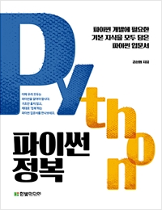

# learn-python

> 예제 및 응용 실습 문제 소스코드 저장소

## Python Textbook

*김상형, [파이썬 정복(파이썬 개발에 필요한 기본 지식을 모두 담은 파이썬 입문서)], 한빛미디어, 2018.04.02*

## Python Exercise

### python-test

> [파이썬 정복] 교재 예제 소스코드 저장소

* 00_baseTest
* 01_ifTest
* 02_forTest
* 03_whileTest
* 04_funcTest
* 05_sequenceTest
* 06_strTest
* 07_formatTest
* 08_listTest
* 09_tupleTest
* 10_dicTest
* 11_setTest
* 12_collectionmgrTest
* 13_moduleTest
* 14_exceptionTest
* 15_fileTest
* 16_fobjectTest
* 17_classTest
* 18_importTest

## Python Laboratory

### python-lab

> 실습 소스코드 저장소

* lab1(6월30일실습1)
* lab2(6월30일실습2)
* lab3(7월1일실습1)
* lab4(7월2일실습1)
* lab5(7월12일실습1)
* lab6(7월13일실습1)
* lab7(7월13일실습2)
* lab8(7월14일실습1)
* lab9(7월19일실습1)
* lab10(7월19일실습2)